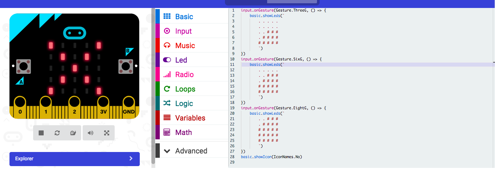

# Accelerometer 
The accelerometer on a microbit measures acceleration. The accelerometer can measure accelerations of between +2g to -2g.

The picture below shows the code which starts the microbit off with a smile but when physically shook, a scrolling text appears; "Stop Shaking Device" 

This Picture shows the code which displays acceleration of 3g's, 6g's and 8g's. The bar rises depending on the G-force it senses

